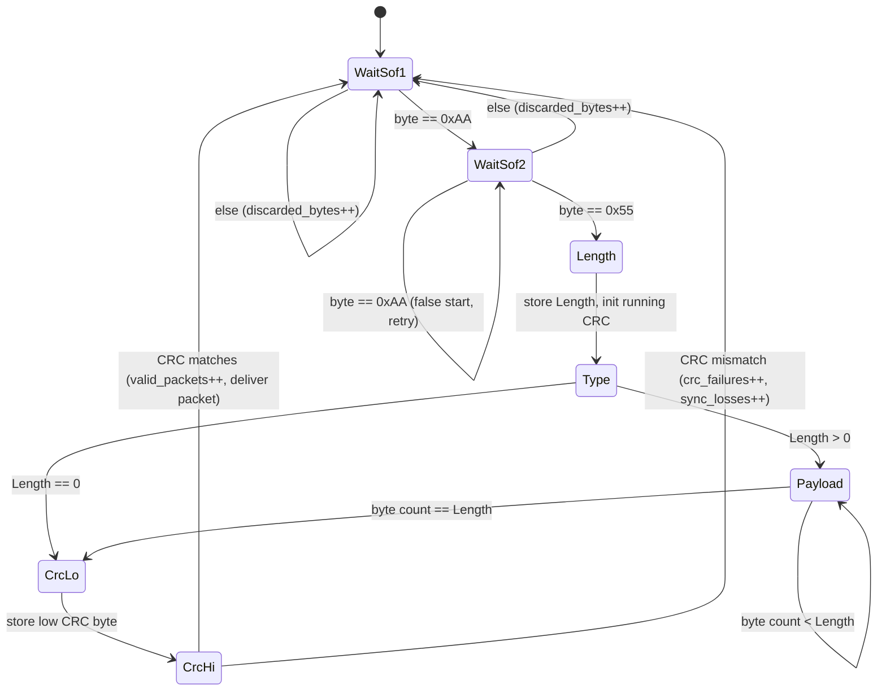
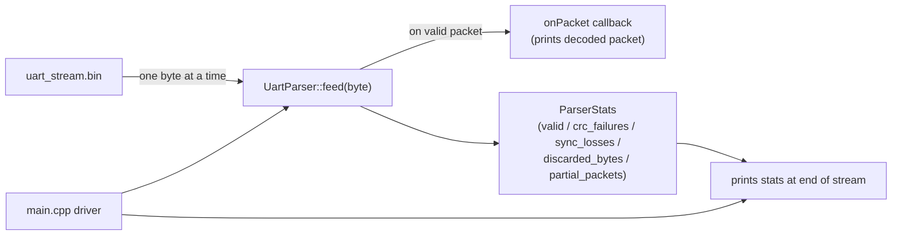

# Task 1 — Streaming UART Protocol Parser

A byte-at-a-time streaming parser for the custom UART protocol:

```
SOF1(0xAA) | SOF2(0x55) | Length | Type | Payload[Length] | CRC16 (2 bytes)
```

See the root [`DESIGN.md`](../DESIGN.md#task-1--streaming-uart-protocol-parser)
for the full architecture writeup, including an important finding: the
CRC coverage in the written assignment spec (`Length + Type + Payload`)
does **not** match the provided sample data. The actual wire format
covers `Type + Payload` only, with the CRC bytes transmitted
little-endian — verified byte-by-byte against `uart_stream.bin` before
any parsing code was written. This is documented in
[`include/uart_parser.hpp`](include/uart_parser.hpp) as well, so it isn't
mistaken for a bug.

## Architecture

`UartParser` is a single class implementing an explicit state machine.
`feed(byte)` advances it by exactly one byte and returns; a decoded
packet is delivered synchronously via callback before `feed()` returns.
No parsing step ever needs to see more than the current byte plus the
handful of fixed-size fields already buffered in the instance:



Driving components:



All state (buffer, running CRC, current field, stats) lives inside the
`UartParser` instance — no globals, no heap allocation on the hot path,
so multiple independent parser instances can run concurrently with zero
shared state between them.

## Layout

```
include/crc16.hpp         CRC-16/CCITT-FALSE (poly 0x1021, init 0xFFFF)
include/uart_parser.hpp   UartParser: the streaming state machine
src/                      Implementations
src/main.cpp              Demo driver (decodes uart_stream.bin, prints stats)
tests/test_uart_parser.cpp  30 dependency-free unit tests
data/                      uart_stream.bin + hex dump (provided sample data)
```

## Build

```bash
mkdir -p build && cd build
cmake .. -DCMAKE_BUILD_TYPE=Release
make -j$(nproc)
```

## Run

```bash
# From inside build/
./uart_parser_tests                        # unit tests (30 checks)
./uart_parser_demo ../data/uart_stream.bin  # decode the sample stream + print stats
```

Expected output (statistics section):

```
valid_packets    : 8
crc_failures     : 4
sync_losses      : 4
discarded_bytes  : 13
partial_packets  : 1
```

## Design highlights

- **Explicit state machine**: `WaitSof1 → WaitSof2 → Length → Type →
  Payload → CrcLo → CrcHi`, one byte in per `feed()` call, at most one
  decoded packet out (via callback).
- **Bounded memory**: payload buffer is a fixed `std::array<uint8_t,255>`
  (255 is the max a single Length byte can express) — no heap allocation
  anywhere on the hot path.
- **No global/shared mutable state**: everything lives in the
  `UartParser` instance, so multiple independent parsers can run
  concurrently.
- **Never enters a fatal state**: any framing/CRC error just drops back
  to hunting for the next `SOF1`/`SOF2` pair.
- **Bonus items implemented**: chunked `feed(data, len)` overload
  (arbitrary chunk sizes, not just one byte at a time), `reset()`, and
  the unit test suite covering corrupted-packet recovery and
  partial-packet handling.

## Demo video

[`demos/task1_uart_parser.mp4`](../demos/task1_uart_parser.mp4) (repo
root) — see [`demos/README.md`](../demos/README.md) if it's not there
yet.
