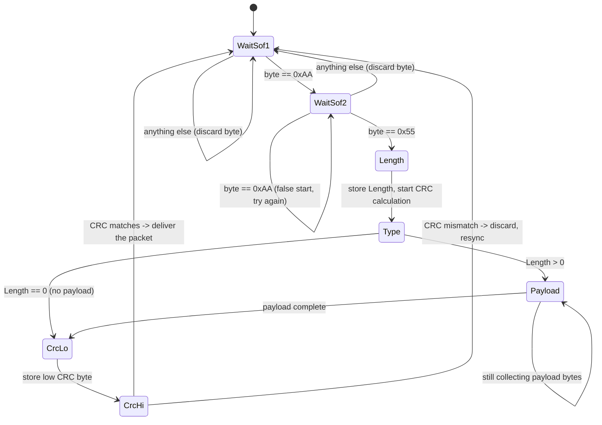
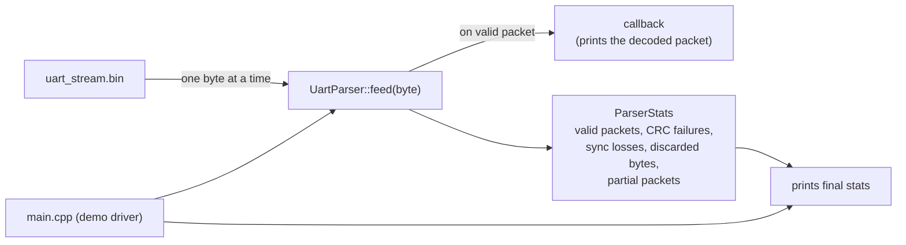

# Task 1 — Streaming UART Protocol Parser

A parser that reads a stream of raw bytes coming from a UART (serial)
connection, one byte at a time, and pulls out valid data packets from it
— while safely ignoring noise, corrupted data, and garbage bytes in
between.

## The packet format

Every valid packet on the wire looks like this:

```
SOF1(0xAA) | SOF2(0x55) | Length | Type | Payload[Length] | CRC16 (2 bytes)
```

| Field | Meaning |
|-------|---------|
| `SOF1`, `SOF2` | Two fixed "start of frame" marker bytes (`0xAA`, `0x55`) that signal *"a new packet starts here."* |
| `Length` | How many bytes are in the payload that follows. |
| `Type` | What kind of packet this is (application-defined). |
| `Payload` | The actual data, `Length` bytes long. |
| `CRC16` | A 2-byte checksum used to verify the packet wasn't corrupted in transit. |

### A finding worth knowing about

The written assignment spec says the CRC should cover
`Length + Type + Payload`. I checked that claim against the actual
sample data byte-by-byte before writing any parsing code — and it
doesn't hold up. The real wire format only covers `Type + Payload`
(Length is excluded), and the two CRC bytes are sent **little-endian**
(low byte first).

This isn't a bug — it's implemented to match what the data actually
does, with the discrepancy called out here and in
[`include/uart_parser.hpp`](include/uart_parser.hpp) so it's clearly
intentional. Full byte-by-byte proof is in the root
[`DESIGN.md`](../DESIGN.md#task-1--streaming-uart-protocol-parser).

## How it works

The parser is built as a **state machine** — at any moment, it's in one
of a handful of clearly-defined states, and each incoming byte either
moves it to the next state or sends it back to square one. `feed(byte)`
processes exactly one byte and returns immediately; if that byte
completes a valid packet, the parser hands it back via a callback before
`feed()` returns.



**In plain terms:** the parser is always hunting for the two start
marker bytes. Once found, it reads the length, the type, that many
payload bytes, then the checksum. If the checksum checks out, it hands
you a clean packet. If anything goes wrong at any step — a bad checksum,
a truncated packet, whatever — it doesn't crash or get stuck. It just
goes back to hunting for the next start marker and carries on.

### How the pieces fit together



## Why it's built this way

- **Bounded, predictable memory.** The payload buffer is a fixed-size
  array (255 bytes — the largest a single `Length` byte can ever
  specify). No dynamic memory allocation happens while parsing, so
  memory use never grows unexpectedly no matter how long the stream is.
- **No shared state.** Everything the parser needs lives inside a single
  `UartParser` object. You could run ten of these in parallel and
  they'd never interfere with each other.
- **It never gets permanently stuck.** Any error — a bad checksum, a cut-
  off packet, unexpected bytes — just sends it back to "listening for
  the next start marker," rather than crashing or freezing.
- **Extras included:** you can feed it a whole chunk of bytes at once
  instead of one at a time, reset it mid-stream, and there's a full test
  suite (30 checks) covering corrupted and partial packets.

## Project layout

```
include/crc16.hpp           CRC-16/CCITT-FALSE implementation
include/uart_parser.hpp     UartParser — the state machine itself
src/                        Implementations of the above
src/main.cpp                Demo: decodes uart_stream.bin, prints results
tests/test_uart_parser.cpp  30 unit tests (no external test framework)
data/                       uart_stream.bin + a hex dump of it (sample data)
```

## Build

```bash
mkdir -p build && cd build
cmake .. -DCMAKE_BUILD_TYPE=Release
make -j$(nproc)
```
## RUN

Then, from inside `build/`:

```bash
./uart_parser_tests                        # run the 30 unit tests
./uart_parser_demo ../data/uart_stream.bin  # decode the sample data + print stats
```


## Demo video

[Watch on Google Drive](https://drive.google.com/file/d/1MX7ZFn-WXs9wkCZtJLWy1ZByh8Mt9Ayd/view?usp=sharing)

## Result explanation

Output from an actual build + run:

```
$ ./uart_parser_tests
30/30 checks passed

$ ./uart_parser_demo ../data/uart_stream.bin
PACKET  type=0x01  len=  3  payload=10 20 30
PACKET  type=0x02  len=  0  payload=
PACKET  type=0x01  len=  2  payload=DE AD
PACKET  type=0x04  len=  1  payload=99
PACKET  type=0x07  len=  2  payload=CA FE
PACKET  type=0x08  len= 20  payload=00 01 02 03 04 05 06 07 08 09 0A 0B 0C 0D 0E 0F 10 11 12 13
PACKET  type=0x01  len=  0  payload=
PACKET  type=0x0A  len=  1  payload=42
--- Parser statistics ---
valid_packets    : 8
crc_failures     : 4
sync_losses      : 4
discarded_bytes  : 13
partial_packets  : 1
```

**Build:** CMake configures a Release build with GCC, producing three
targets — `uart_parser_lib` (the static library), `uart_parser_tests`,
and `uart_parser_demo`. All three link cleanly with no warnings shown.

**Test run — `30/30 checks passed`:** every unit test passes, meaning
the state machine's handling of valid packets, corrupted CRCs,
truncated streams, and edge cases (zero-length payload, back-to-back
SOF bytes, etc.) all behave as expected.

**Demo run — decoding `uart_stream.bin`:**

- **8 valid packets** were extracted from the stream, with payload
  lengths ranging from 0 bytes up to 20 bytes, across several
  different `Type` values (`0x01`, `0x02`, `0x04`, `0x07`, `0x08`,
  `0x0A`). This confirms the parser correctly handles the full
  length range, not just a single fixed size.
- **4 CRC failures** — packets that were framed correctly (valid
  SOF1/SOF2/Length/Type) but whose checksum didn't match. The
  parser detected the mismatch, discarded the packet, and resumed
  hunting for the next start marker rather than misinterpreting
  corrupted data as valid.
- **4 sync losses** — points in the stream where the parser had to
  drop out of an in-progress packet and go back to searching for
  `0xAA 0x55`, typically because unexpected bytes appeared where a
  valid field was expected.
- **13 discarded bytes** — stray/noise bytes that never matched a
  valid frame at all and were skipped over one at a time.
- **1 partial packet** — a packet that started correctly but the
  stream ended before it could be completed (e.g. cut off mid-payload
  or mid-CRC), which the parser reported rather than silently
  dropping or crashing on.


