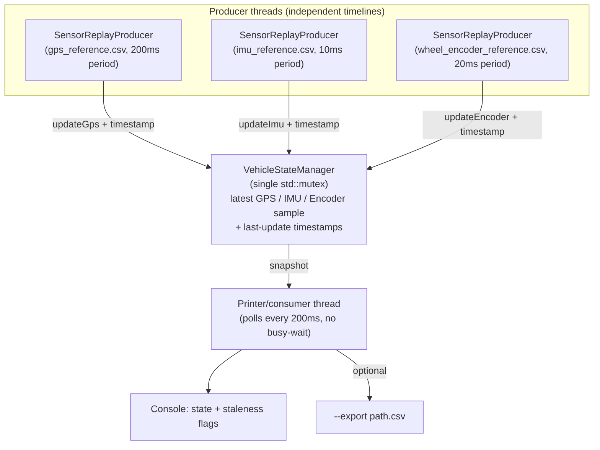

# Task 2 — Multi-Sensor Data Aggregator

Replays `gps_reference.csv`, `imu_reference.csv`, and
`wheel_encoder_reference.csv` concurrently — one producer thread per
sensor, each respecting its own original inter-sample timing — and
maintains a single, latest `VehicleState` combining all three, with
staleness detection per the assignment's thresholds.

See the root [`DESIGN.md`](../DESIGN.md#task-2--multi-sensor-data-aggregator)
for the full architecture writeup (threading model, why a single mutex is
fine here, the replay-timing assumption, and the stall-injection bonus).

## Architecture

Three fully independent producer threads (one per sensor CSV), a single
shared, mutex-protected state holder, and a printer/consumer thread that
polls it on a fixed cadence. This is a classic producer-consumer
arrangement with *multiple* producers and one logical consumer that
always reads the latest value per source — no merging or interpolation
across sensors, since each has its own sampling rate and timeline.



**Shutdown path:** each producer's `run()` loop checks an atomic
`stop_requested_` flag before, and is interruptible during, every sleep
(via `condition_variable::wait_until`). `main()` calls `requestStop()` +
`join()` on all three uniformly, whether they finished naturally at the
end of their CSV or were stopped early — no thread is ever left running
or blocked past shutdown.

## Layout

```
include/vehicle_state.hpp   VehicleStateManager: thread-safe latest-state holder
include/sensor_producer.hpp SensorReplayProducer: one thread per sensor CSV
include/csv_reader.hpp      Minimal hand-rolled CSV reader
src/main.cpp                Demo driver: wires producers + printer thread together
data/                        gps/imu/wheel_encoder reference CSVs (provided sample data)
```

## Build

```bash
mkdir -p build && cd build
cmake .. -DCMAKE_BUILD_TYPE=Release
make -j$(nproc)
```

## Run

```bash
# From inside build/

# Real-time replay (~8s), prints VehicleState + staleness every 200ms
./sensor_aggregator_demo --data-dir ../data

# Bonus: inject a stall on the IMU stream starting at source-time 2000ms,
# and export the synchronized state stream to CSV
./sensor_aggregator_demo --data-dir ../data --speed 20 \
    --stall imu --stall-after 2000 --stall-duration 3000 \
    --export /tmp/vehicle_state.csv
```

Run `./sensor_aggregator_demo --help` for all options.

## Design highlights

- **One thread per sensor**: genuinely independent producers, each with
  its own timeline, per the assignment's note that GPS/IMU/Encoder should
  be treated as independent producers rather than a single merged stream.
- **Single shared mutex** protecting `VehicleStateManager` — the only
  shared mutable state in the system. Update rates are tens of Hz at
  most, so contention is a non-issue, and one lock means no
  lock-ordering/deadlock concerns.
- **No busy-waiting**: producers sleep via
  `condition_variable::wait_until()` against a shared replay-start time,
  so they're fully descheduled between events and can be woken instantly
  by `requestStop()` for prompt, graceful shutdown.
- **Replay timing assumption**: default speed is 1.0x (real time) — the
  spec's staleness thresholds (GPS 500ms / IMU 50ms / Encoder 100ms) are
  wall-clock values, so real-time is the mode in which they mean what
  they say. `--speed` is provided for convenience.
- **Bonus items implemented**: stall injection (demonstrates staleness
  detection firing and clearing correctly) and CSV export of the
  synchronized state stream.

## Demo video

[Watch on Google Drive](https://drive.google.com/file/d/10urt2L4_-be85wKvlOMWdSBv9qost45I/view?usp=sharing)

## Result 

**Build:** CMake configures cleanly with pthreads detected, producing
`sensor_aggregator_lib` and the `sensor_aggregator_demo` executable
with no warnings.

**Real-time run (`--data-dir ../data`, speed 1.0x):**
- Loaded 36 GPS, 793 IMU, 393 Encoder samples, and replayed them for
  ~8s, matching the source data's own timeline.
- Each 200ms printout shows GPS, IMU, and Encoder all updating
  independently at their own rates (GPS every 200ms, IMU near-continuously,
  Encoder every 20ms) — confirming they're genuinely separate producer
  timelines, not one merged/interpolated stream.
- Around t=3.0s–3.8s, GPS briefly went `STALE` while its `src` timestamp
  held at 2800ms — a real gap in the GPS input data — while IMU and
  Encoder kept updating normally, showing staleness is tracked
  **per-sensor**, not globally.
- Ended with all three sensors fresh at t≈8.0s and a clean shutdown
  message, confirming all producer threads joined properly.

**Stall-injection run (`--speed 20 --stall imu --stall-after 2000 --stall-duration 3000`):**
- At 20x speed, GPS and Encoder race ahead to their final values almost
  immediately, while IMU is deliberately frozen at `src=1990ms` —
  exactly where the injected stall starts.
- IMU correctly flips to `STALE` and stays there for the full stall
  window, while GPS/Encoder also eventually go `STALE` once the run
  outpaces their last update (since the whole stream finishes before
  the print loop naturally catches up).
- IMU recovers (`ok src=4070ms`, then `src=8000ms`) right after the
  stall duration elapses, proving staleness detection **both fires and
  clears correctly**, and that a stalled sensor doesn't block or slow
  down the other two.

