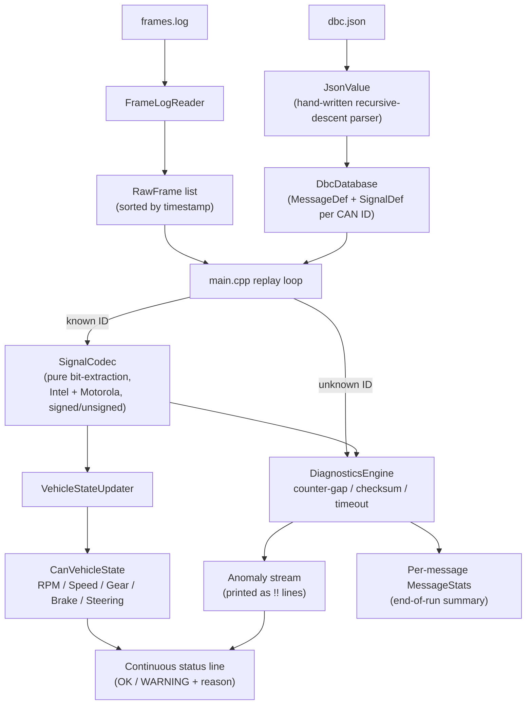

# Task 3 — CAN Decoder & Vehicle State

Decodes CAN frames from `frames.log` against the signal database in
`dbc.json`, maintains a live `VehicleState` (RPM, Speed, Gear, Brake
Status, Steering Angle), and reports counter/checksum/timeout anomalies —
including the three faults deliberately injected into the sample log.

See the root [`DESIGN.md`](../DESIGN.md#task-3--can-decoder--vehicle-state)
for the full architecture.

## Architecture

A single-threaded pipeline: `frames.log` is read and sorted once, then
replayed in timestamp order, decoding each frame against the signal
database and feeding it through diagnostics before updating the live
vehicle state. Nothing in the spec requires concurrent producers here
(unlike Task 2) since `frames.log` is already one interleaved trace.



Between frame arrivals, the replay loop wakes on a short poll interval
(not a busy loop) purely to re-check `DiagnosticsEngine::checkTimeouts()`
— this is what lets a gap like the injected 310ms `SteeringData` stall get
flagged mid-wait, well before the next real frame shows up, rather than
only being noticed retroactively.

## Layout

```
include/json_value.hpp     Minimal hand-written JSON parser (for dbc.json)
include/dbc_database.hpp   DbcDatabase: loads dbc.json into MessageDef/SignalDef
include/signal_codec.hpp   SignalCodec: pure bit-extraction / physical decode
include/frame_log_reader.hpp  Parses frames.log
include/diagnostics.hpp    DiagnosticsEngine: counter-gap, checksum, timeout checks
include/vehicle_state.hpp  VehicleStateUpdater + CanVehicleState
src/main.cpp               Demo driver: single-threaded replay of frames.log
tests/test_can_decoder.cpp 9 dependency-free unit tests
data/                       dbc.json, vehicle.dbc, frames.log (provided sample data)
```

## Build

```bash
mkdir -p build && cd build
cmake .. -DCMAKE_BUILD_TYPE=Release
make -j$(nproc)
```

## Run

```bash
# From inside build/
./can_decoder_tests                                 # unit tests (9 checks)
./can_decoder_demo --data-dir ../data                # real-time replay (~1s)
./can_decoder_demo --data-dir ../data --speed 50      # accelerated replay
./can_decoder_demo --data-dir ../data --summary-only  # just the anomaly lines + summary
```

## Design highlights

- **`dbc.json` over `vehicle.dbc`**: chosen because its `start_bit`
  values are already-normalized bit indices, sidestepping the DBC text
  format's own big-endian bit-numbering convention. `vehicle.dbc`'s
  comments were still used to determine the checksum algorithm.
- **Checksum**: XOR of the other 7 bytes in the frame (from `vehicle.dbc`'s
  `CM_` comment, verified against every frame in the log).
- **Timeout thresholds**: `period_ms × 3`, derived from `dbc.json` rather
  than picked arbitrarily, per the assignment's instruction.
- **Unknown CAN IDs**: handled gracefully — logged, counted, never
  crashes (`DiagnosticsEngine::onUnknownFrame`), covered by a unit test.
- **Bonus items implemented**: rolling per-message counters + end-of-run
  summary, and unit tests covering Intel vs. Motorola, signed vs.
  unsigned decoding.

## Demo video

[Watch on Google Drive](https://drive.google.com/file/d/1fUYBXdtku4Z899UY06t1W9Jic5UEP4kr/view?usp=sharing)

## Result explanation

**Build:** CMake configures cleanly, producing `can_decoder_lib`,
`can_decoder_tests`, and `can_decoder_demo` with no warnings.

**Unit tests — `9/9 checks passed`:** confirms Intel and Motorola bit
decoding, signed/unsigned signals, checksum/counter/timeout diagnostics,
and unknown-ID handling all work as designed.

**Real-time run (`--data-dir ../data`):**
- Loaded 4 DBC messages and 224 log frames, replayed in ~1s at 1.0x speed.
- `VehicleState` (RPM, Speed, Gear, Brake, Steering) updates live as each
  frame arrives, each field only changing when its own message is
  decoded — confirming per-signal, not per-frame, state updates.
- All three **injected faults** were caught exactly as expected:
  - **Timeout** — `SteeringData` (0x2B0) went 49ms without a frame
    against a 30ms threshold, flagged mid-wait rather than only after
    the next frame arrived.
  - **Counter gap** — `VehicleSpeed` (0x220) jumped from counter 8 to
    11 (expected 9), a discontinuity indicating dropped or reordered
    frames.
  - **Checksum mismatch** — `EngineData` (0x180) had `0xdf` on the wire
    where `0x20` was expected.
- The status line stayed `OK` at every step outside these three
  moments — anomalies didn't cause false positives elsewhere.

**Accelerated run (`--speed 50`):** identical fault detections and final
state, just compressed in wall-clock time — confirms detection is driven
by the frames' own timestamps, not real-time polling artifacts (note the
timeout is flagged slightly earlier, at 31ms over vs 49ms, since the
poll interval scales with speed too).

**`--summary-only` run:** isolates just the 3 anomaly lines plus the
final per-message summary table, showing at a glance that:

| Message | Frames | Counter faults | Checksum faults | Timeouts |
|---|---|---|---|---|
| EngineData (0x180) | 51 | 0 | 1 | 0 |
| BrakeStatus (0x1A0) | 51 | 0 | 0 | 0 |
| VehicleSpeed (0x220) | 51 | 1 | 0 | 0 |
| SteeringData (0x2B0) | 71 | 0 | 0 | 1 |

with **0 unknown-ID frames** — every frame in the log matched a known
message definition.

all three deliberately injected faults were found
exactly once each, on the correct message, with no false positives —
demonstrating the diagnostics engine is both sensitive enough to catch
real issues and precise enough not to cry wolf on healthy traffic.
