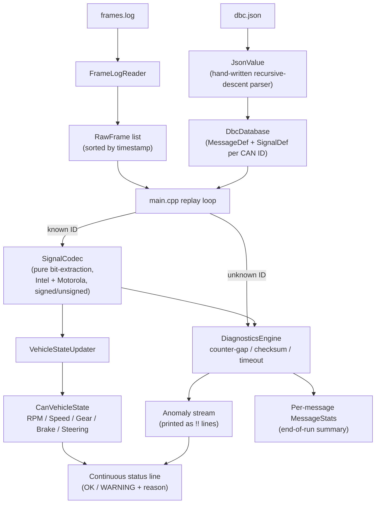

# Task 3 — CAN Decoder & Vehicle State

Decodes CAN frames from `frames.log` against the signal database in
`dbc.json`, maintains a live `VehicleState` (RPM, Speed, Gear, Brake
Status, Steering Angle), and reports counter/checksum/timeout anomalies —
including the three faults deliberately injected into the sample log.

See the root [`DESIGN.md`](../DESIGN.md#task-3--can-decoder--vehicle-state)
for the full architecture writeup, including two things worth reading
before the interview discussion:
- How the Motorola (big-endian) bit-numbering convention used by
  `dbc.json` was empirically verified (not assumed) against the sample
  frames.
- How the checksum algorithm (XOR of the other 7 bytes) was confirmed
  against every frame in the log, and how the three injected faults were
  found.

## Architecture

A single-threaded pipeline: `frames.log` is read and sorted once, then
replayed in timestamp order, decoding each frame against the signal
database and feeding it through diagnostics before updating the live
vehicle state. Nothing in the spec requires concurrent producers here
(unlike Task 2) since `frames.log` is already one interleaved trace.



Between frame arrivals, the replay loop wakes on a short poll interval
(not a busy loop) purely to re-check `DiagnosticsEngine::checkTimeouts()`
— this is what lets a gap like the injected 310ms `SteeringData` stall get
flagged mid-wait, well before the next real frame shows up, rather than
only being noticed retroactively.

## Layout

```
include/json_value.hpp     Minimal hand-written JSON parser (for dbc.json)
include/dbc_database.hpp   DbcDatabase: loads dbc.json into MessageDef/SignalDef
include/signal_codec.hpp   SignalCodec: pure bit-extraction / physical decode
include/frame_log_reader.hpp  Parses frames.log
include/diagnostics.hpp    DiagnosticsEngine: counter-gap, checksum, timeout checks
include/vehicle_state.hpp  VehicleStateUpdater + CanVehicleState
src/main.cpp               Demo driver: single-threaded replay of frames.log
tests/test_can_decoder.cpp 9 dependency-free unit tests
data/                       dbc.json, vehicle.dbc, frames.log (provided sample data)
```

## Build

```bash
mkdir -p build && cd build
cmake .. -DCMAKE_BUILD_TYPE=Release
make -j$(nproc)
```

## Run

```bash
# From inside build/
./can_decoder_tests                                 # unit tests (9 checks)
./can_decoder_demo --data-dir ../data                # real-time replay (~1s)
./can_decoder_demo --data-dir ../data --speed 50      # accelerated replay
./can_decoder_demo --data-dir ../data --summary-only  # just the anomaly lines + summary
```

Expected anomaly output (`--summary-only`):

```
!! [t=  439ms] TIMEOUT  SteeringData   0x2B0  no frame for 49ms (period=10ms, threshold=30ms)
!! [t=  500ms] CTR_GAP  VehicleSpeed   0x220  counter discontinuity: expected 9, got 11 (prev=8)
!! [t=  600ms] CHKSUM   EngineData     0x180  checksum mismatch: expected 0x20, got 0xdf
```

## Design highlights

- **`dbc.json` over `vehicle.dbc`**: chosen because its `start_bit`
  values are already-normalized bit indices, sidestepping the DBC text
  format's own big-endian bit-numbering convention. `vehicle.dbc`'s
  comments were still used to determine the checksum algorithm.
- **Checksum**: XOR of the other 7 bytes in the frame (from `vehicle.dbc`'s
  `CM_` comment, verified against every frame in the log).
- **Timeout thresholds**: `period_ms × 3`, derived from `dbc.json` rather
  than picked arbitrarily, per the assignment's instruction.
- **Unknown CAN IDs**: handled gracefully — logged, counted, never
  crashes (`DiagnosticsEngine::onUnknownFrame`), covered by a unit test.
- **Bonus items implemented**: rolling per-message counters + end-of-run
  summary, and unit tests covering Intel vs. Motorola, signed vs.
  unsigned decoding.

## Demo video

[Add a link or embedded video of this task's demo here — see the root
README's "Demo Videos" section for instructions.]
